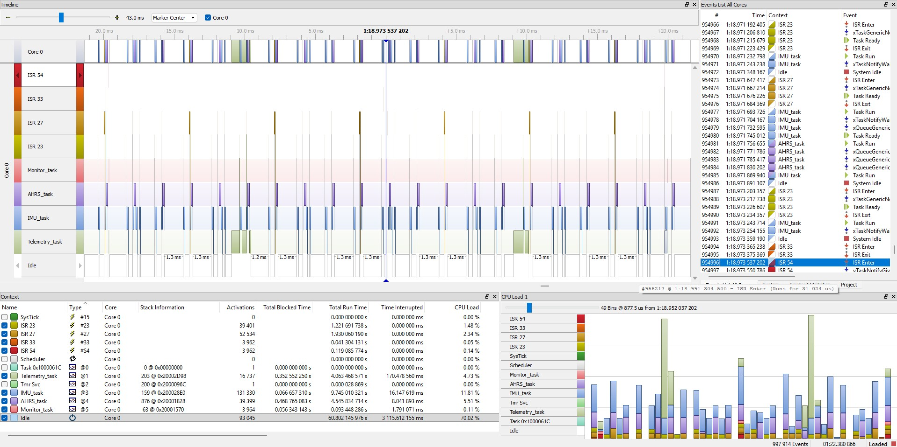

# STM32 9-DOF AHRS — MPU6050 + QMC5883P + FreeRTOS Madgwick Fusion

A real-time Attitude and Heading Reference System (AHRS) running on an STM32F4 microcontroller. It fuses a 6-axis IMU (MPU6050) and a 3-axis magnetometer (QMC5883P) with an adaptive Madgwick filter under FreeRTOS, streaming orientation (quaternion + Euler angles) plus raw sensor data over UART for visualization in a 3D viewer or logging tool.

## Project Motivation & Scope

This project was developed as a technical deep-dive into **real-time embedded systems, RTOS architectures, and sensor fusion algorithms**. 

Rather than building a fully consumer-ready product with peripheral features (like physical buttons, displays, or runtime UI), the primary engineering focus was strictly directed toward the core flight-controller architecture:
* Achieving a zero-blocking, DMA-driven hardware pipeline.
* Implementing a safe and deterministic RTOS task hierarchy.
* Solving real-world sensor fusion challenges (Hard/Soft-Iron anomalies, Gimbal Lock prevention via Quaternions).

As a result, certain operational features (such as runtime calibration triggers) are currently handled via code-recompilation. These are acknowledged in the *Known Issues* section and left as future improvements, keeping the current codebase laser-focused on core AHRS stability.

## Features

- **Interrupt + DMA driven sensor pipeline** — no blocking I2C reads in any task; the IMU data-ready interrupt drives a single-bus DMA scheduler shared between the accelerometer/gyroscope and the magnetometer.
- **Adaptive 6-DOF / 9-DOF fusion** — falls back to accelerometer+gyroscope-only fusion when the magnetometer is unavailable or its reading looks physically invalid, and blends the magnetometer back in with a smooth gain ramp instead of a hard switch.
- **Flash-persisted calibration** — accelerometer 6-point calibration, and magnetometer hard-iron/soft-iron calibration are stored in dedicated flash sectors and reloaded on boot.
- **Watchdog-supervised tasks** — an independent monitor task feeds the hardware IWDG only when every critical task has reported liveness within a bounded window; a stuck task triggers a diagnostic print and, ultimately, a hardware reset instead of a silent hang.
- **Fixed-rate UART telemetry** — 50 Hz CSV-style stream of quaternion, Euler angles, raw accel/gyro/mag, and temperature, transmitted via UART DMA so the telemetry task never blocks the fusion loop.

## Hardware

| Component      | Part      | Interface | Notes                                             |
|-----------------|-----------|-----------|----------------------------------------------------|
| MCU             | STM32F4xx | —         | HSI + PLL, TIM2 (µs timestamp), TIM6 (HAL timebase)|
| IMU             | MPU6050   | I2C1      | DRDY interrupt on `INTA_Pin`, I2C bypass enabled  |
| Magnetometer    | QMC5883P  | I2C1 (via MPU6050 bypass) | Read every 3rd IMU sample (decimated) |

SysTick is strictly dedicated to the FreeRTOS scheduler, while TIM6 is reserved for the STM32 HAL timebase to prevent interrupt priority conflicts.

Both sensors share a single I2C bus; the MPU6050's I2C bypass mode exposes the magnetometer directly to the MCU. A software I2C bus-recovery routine runs at boot (bit-banged clock pulses) in case the bus was left in a stuck state by a previous reset.


## System Architecture

Four FreeRTOS tasks communicate through single-slot "overwrite" queues (each queue always holds the latest value, so slower consumers never block producers):

```text
EXTI (MPU DRDY) ─┐
                 ▼
           ┌─────────────┐   xIMUQueue    ┌─────────────┐   xTelemetryQueue   ┌────────────────┐
 DMA ISR ─▶│  IMU_Task   │───────────────▶│  AHRS_Task  │────────────────────▶│ Telemetry_Task │──▶ UART DMA
           │ (I2C sched.)│   xMagQueue    │  (Madgwick) │                     │   (50 Hz)      │
           └─────────────┘───────────────▶└─────────────┘                     └────────────────┘
                  │                              │                                     │
                  ▼                              ▼                                     ▼
            IWDG-alive bit                 IWDG-alive bit                    IWDG-alive bit
                  │                              │                                     │
                  └──────────────────────────────┼─────────────────────────────────────┘
                                                 ▼
                                        ┌─────────────────┐
                                        │  Monitor_Task   │──▶ HAL_IWDG_Refresh (only if all tasks alive)
                                        └─────────────────┘
```

- **IMU_Task** — highest-frequency task; state machine driven by task notifications from the EXTI callback (data ready) and I2C DMA completion callbacks. Owns the single I2C bus and arbitrates between IMU and magnetometer reads so they never collide.
- **AHRS_Task** — blocks on the IMU queue (the pacing source), opportunistically drains the magnetometer queue, runs the Madgwick update, and publishes the resulting quaternion/Euler angles.
- **Telemetry_Task** — fixed 50 Hz `vTaskDelayUntil` loop, peeks the latest telemetry packet (never consumes it, so AHRS_Task's `xQueueOverwrite` is never blocked), formats it, and hands it to UART DMA.
- **Monitor_Task** — highest-priority task; waits for all three "alive" bits with a bounded timeout and only refreshes the IWDG when every task has checked in, so a single hung task eventually forces a hardware reset rather than the system limping along with stale data.

## Sensor Fusion Strategy

### 6-DOF / 9-DOF adaptive blending

The magnetometer is validated every time a new sample arrives:

1. **Magnitude check** — `|B|` must fall within a tolerance band of the expected local field strength (`EXPECTED_MAG_NORM`, currently set for Ankara, Turkiye — **update this for your location**).
2. **Debounce** — a sample only counts as "valid" after `MAG_VALID_DEBOUNCE_COUNT` consecutive in-range readings, so a single lucky sample during a magnetic disturbance can't flip the filter into full 9-DOF trust.
3. **Gain ramp** — once validated, the magnetometer's influence (`filter.beta`) ramps linearly from 0 to `BETA_9DOF` over `MAG_TRANSITION_TIME_S`, instead of jumping instantly. This prevents the visible "sudden yaw snap" that a hard 6→9 DOF switch causes when the gyro has accumulated even a small amount of yaw drift.
4. **Timeout fallback** — if no magnetometer sample arrives for 500 ms, the filter drops back to gyro+accel-only fusion (`BETA_6DOF`) automatically.

## Safety & Recovery Mechanisms

**Watchdog (IWDG)** — `Monitor_Task` waits for all three "alive" bits with a bounded timeout. If a task hangs (e.g., I2C bus lock), the system forces  a hardware reset to recover automatically.

**Stack Overflow Protection** — configured with `configCHECK_FOR_STACK_OVERFLOW = 2`. If any task exceeds its allocated RAM, `vApplicationStackOverflowHook` catches the breach, disables interrupts, logs the fatal error via UART, and immediately resets the MCU to prevent silent data corruption.

## Calibration

| Sensor          | Method                                   | Trigger                         | Storage                          |
|-----------------|------------------------------------------|---------------------------------|----------------------------------|
| Gyroscope       | 1000-sample static bias average          | Every boot                      | RAM only (fast, cheap, no drift over reflashes) |
| Accelerometer   | 6-point (±X, ±Y, ±Z) guided calibration  | First boot / flash sector empty | Flash sector 11 (`0x080E0000`)   |
| Magnetometer    | 50-second min/max sweep, hard/soft-iron  | First boot / flash sector empty | Flash sector 10 (`0x080C0000`)   |

For the accelerometer and magnetometer, a forced re-calibration block is present in `main.c` but commented out — uncomment it (or add a button/command trigger) if you need to recalibrate without erasing flash manually.

## Building & Flashing

This is an STM32CubeIDE / STM32CubeMX project using the STM32 HAL and
FreeRTOS.

1. Open the project in STM32CubeIDE (or regenerate with CubeMX if you change
   pin/peripheral configuration — **do not** hand-edit code outside the
   `USER CODE BEGIN/END` blocks, it will be overwritten on regeneration).
2. **CubeMX Regeneration Warning:** Regenerating the code via STM32CubeMX will overwrite the FreeRTOS port files (`port.c` and `portmacro.h`). To maintain SEGGER SystemView compatibility, you must manually re-inject the `vSetVarulMaxPRIGROUPValue()` function implementation into `port.c`, and add its corresponding prototype into `portmacro.h` after each regeneration.
3. 3. **SystemView Profiling:** SEGGER SystemView tracking is optional and disabled by default to save CPU cycles and memory. To enable real-time performance profiling, simply uncomment `#define USE_SEGGER_SYSVIEW` inside `main.h` before building.
4. Build and flash normally (`Debug` or `Release` target).
5. On first boot, watch the UART log (see below) — it will report gyro
   calibration, and prompt for accelerometer/magnetometer calibration if no
   valid data is found in flash.

## Telemetry Protocol

`Telemetry_Task` transmits one CSV line at 50 Hz over `USART2`:

```
q0,q1,q2,q3,pitch_deg,roll_deg,yaw_deg,ax_g,ay_g,az_g,gx_radps,gy_radps,gz_radps,mx_gauss,my_gauss,mz_gauss,temp_c\r\n
```

This format is intended to be consumed directly by a 3D orientation viewer
(quaternion fields) while also exposing raw sensor values for logging/plotting.

## Performance

Measured with SEGGER SystemView:



| Task / ISR        | CPU Load |
|-------------------|---------:|
| Idle              | 70.0 %   |
| IMU_Task          | 11.8 %   |
| AHRS_Task         | 5.5 %    |
| Telemetry_Task    | 4.7 %    |
| ISR27 / ISR23     | 2.3 % / 1.5 % |
| ISR33 / ISR54     | < 1.0 %  |

*\* **Interrupt Service Routines (ISR):** In the STM32F4 vector table, these specific exception numbers correspond to the hardware drivers running the sensor pipeline without blocking the CPU:*
*   ***ISR23 (EXTI):*** *Handles the EXTI hardware interrupt triggered by the MPU6050's Data Ready (DRDY) pin.*
*   ***ISR27 (DMA1 Stream 0):*** *Handles the I2C1 RX DMA transfer completion (fetching sensor data).*
*   ***ISR33 (DMA1 Stream 6):*** *Handles the USART2 TX DMA completion (streaming telemetry).*
*   ***ISR54 (USART2):*** *The global UART interrupt, triggered upon telemetry transmission events.*

SystemView analysis confirms that the RTOS pipeline operates flawlessly. The system experiences a brief, expected buffer overflow only during the initial MCU startup and sensor calibration phase. Once the scheduler stabilizes, the tasks run with precise timing, zero starvation, and no dropped frames. The hardware DMA handles the heavy lifting, leaving the CPU mostly idle and highly responsive.

## Known Issues

These are open items worth knowing about before relying on this in a
safety-relevant application — contributions welcome:

- [ ] **Flash calibration sectors (10 & 11):** Verify your linker script keeps the application image well clear of these addresses before growing the codebase.

- [ ] **Magnetometer Limitations:** The QMC5883P is highly sensitive to external magnetic fields (both Hard-Iron and Soft-Iron distortions). Environmental changes, such as nearby ferrous metals, breadboard clips, or electronic devices, can significantly alter the local magnetic vector. Proper and frequent calibration in the sensor's final operating environment is strictly required for accurate Yaw tracking.

- [ ] **Calibration Trigger Mechanism:** The current method of forcing a re-calibration by uncommenting a code block in `main.c` and recompiling the firmware is highly inefficient for field deployments. Future revisions should implement a runtime trigger (e.g., a physical button via EXTI or a UART command parser) to initiate the calibration sequence without requiring a firmware re-flash.


## License

This project is licensed under the MIT License. You are free to use, modify, and distribute this software, provided that the original copyright notice and permission notice are included in all copies or substantial portions of the software.

Note: This repository builds on STMicroelectronics HAL drivers and FreeRTOS, which are governed by their own respective licenses (see the headers in Drivers/ and Middlewares/).
